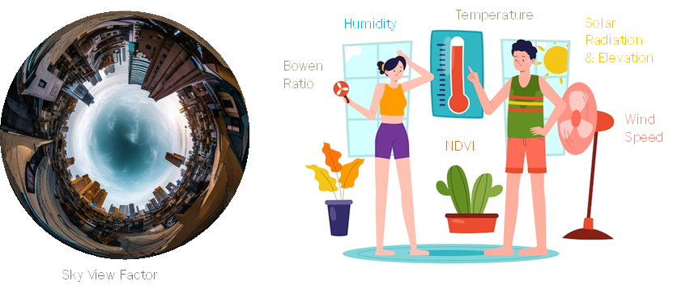

# Section 2: Understanding the Science Behind PET

To make the most of PET calculations, it's essential to grasp the underlying science. We'll keep things simple and explain the key concepts as we go, so don't worry if you're not a science whiz. Here are a few terms you'll encounter:

## 1. Physiological Equivalent Temperature (PET): 
PET is a numerical value that combines temperature and humidity to estimate the perceived thermal comfort. It helps us understand how the weather conditions affect our bodies.

The PET model was developed to address the need for standardized urban heat maps in the Netherlands for climate stress tests. These tests evaluate the effects of heat stress on infrastructure and society. The development of a unified methodology using PET as a metric for heat stress was prompted by the abundance of different heat maps produced by various agencies using various metrics and methods.

The PET model generates a standardized heat map, taking into account variables like weather information, street configurations, and the urban heat island effect. It aims to inform decision-makers about hotspots and support the planning of infrastructure and climate adaptation measures. The PET model analyses variables other than air temperature, including wind speed, humidity, and radiation load, which affect how humans perceive heat.

By combining empirical meteorological models and GIS-based tools, the PET model offers a cost-effective and practical approach to generating heat maps. It allows for the estimation of urban air temperatures and wind speeds using routine weather observations and information about land use and building geometries. The PET model has been tested and validated in the town of Wageningen, with heat maps provided for representative hot days and an average summer period. It also includes a projection for the warmest climate scenario in 2050.

Overall, the PET model addresses the need for standardized and high-resolution heat maps that capture small-scale hotspots and are essential for climate stress tests and decision-making regarding climate adaptation measures. The proposed formula by (Koopmans et al.) states the PET model as follows:

𝑃𝐸𝑇𝑠𝑢𝑛 = −13.26 + 1.25𝑇𝑎 + 0.011𝑄𝑠 − 3.37 𝑙𝑛(𝑢1.2 ) + 0.078𝑇𝑤 + 0.0055𝑄𝑠 𝑙𝑛(𝑢1.2) +5.56 𝑠𝑖𝑛(𝜑) − 0.0103𝑄𝑠 𝑙𝑛(𝑢1.2 ) 𝑠𝑖𝑛(𝜑) + 0.54Bb + 1.94𝑆𝑣f

--- 

---

## Temperature (Ta): 
The measure of how hot or cold something is, typically measured in degrees Celsius (°C) or Fahrenheit (°F), in this case, it will be applied to the urban air temperature.
## Humidity (𝜙): 
The amount of moisture present in the air. It affects how our bodies perceive the temperature. Higher humidity can make it feel hotter, while lower humidity can make it feel cooler.
## Wind Speed (u1.2): 
The measurement of the speed at which air molecules pass a specific location on the surface of the Earth. Usually, it is expressed as a number of meters per second (m/s), miles per hour (mph), or knots.
## Solar Radiation (Qs): 
The electromagnetic waves that are produced by the Sun and travel from it to the Earth. These waves may be absorbed, reflected, or scattered when they enter the atmosphere of the Earth. The photosynthesis of plants, the heating of the atmosphere, and the regulation of weather patterns are just a few of the processes on our planet that depend on this solar energy.
## Solar Elevation angle (φ): 
The Sun's altitude above the horizon at a specific spot on Earth. It is affected by a number of variables, such as the time of day, the observer's latitude, and the season of the year, and changes throughout the day as the Sun rises, reaches its highest point, and then sets.
## Sky View Factor (Svf): 
Is a measurement of the area of the sky that can be seen from a particular spot on the surface of the Earth. It measures the extent to which the sky can be seen without being obscured by nearby structures, trees, or other objects. An unobstructed view of the sky is indicated by a sky view factor of 1, or 100%, which means that the entire sky is visible. On the other hand, a sky view factor of 0 or 0% indicates total obstruction because no part of the sky is visible. 
The sky view factor, when visualized, has a resemblance to the perspective of a fish-eye camera lens. This is because the sky view factor calculation captures a wide-angle view of the sky, resulting in a distorted perspective similar to what you would see in fish-eye photographs.
## Bowen Ratio (Bb): 
Is a metric used in meteorology to evaluate the equilibrium between the processes of heating and cooling the Earth's surface. The relationship between the quantity of heat transferred to the air by way of direct warming and the quantity of heat transferred by way of moisture evaporation is quantified. While a low Bowen ratio suggests that more heat is transferred through latent heat flux (evaporation), a high Bowen ratio suggests that more heat is transferred through sensible heat flux (warming the air directly).
## Wet bulb temperature (Tw): 
The lowest temperature that can be attained through evaporative cooling. It is measured using a wet cloth that is wrapped around a thermometer bulb to measure the temperature drop brought on by evaporation.
The cooling effect that happens when moisture evaporates from a surface, like human skin, as a result of the presence of water vapour in the air is more simply described by the wet-bulb temperature
## NDVI: 
Normalized Difference Vegetation Index is what this term stands for. It is a straightforward numerical indicator that measures vegetation health and density using satellite or aerial image processing.
The near-infrared (NIR) and visible red light reflectance are compared to determine the "greenness" of a location. greatly reflecting the majority of the NIR light, healthy vegetation greatly absorbs visible red light. NDVI values ranging from -1 to +1 are derived by computing the difference between these two bands and dividing it by their sum.
## Thermal Comfort: 
The level of satisfaction or discomfort a person feels based on the thermal environment. It's influenced by factors like temperature, humidity, air movement, and personal factors such as clothing and activity level.

#### [Next](Section%203.md)