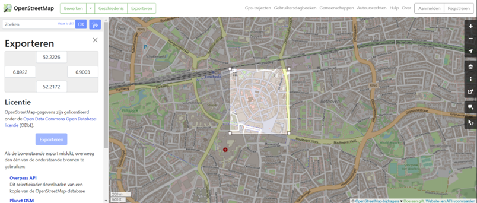

## 4. Trees

a.	In our case, we had access to the tree shapes files from the Municipality of Enschede, this files are a bit more accurate but  not public. You can still find tree shapefiles by visiting https://www.openstreetmap.org/ and clicking the button Export in the top menu.

b.	Select the desired area to be exported and click the button ‘Export’, if the area is within the allowed size limitations from OpenStreetMap’s you can save the .OSM file in your computer.

c.	This file can be loaded in to a large variety of GIS software including ArcGIS and QGIS, you can load them and do a selection by expression to isolate the trees in a new layer.

d.	ArcGIS Pro does not natively support the .osm file format in the Catalog pane. However, you can use the ArcGIS Editor for OpenStreetMap (OSM) extension to import and work with .osm files in ArcGIS Pro. Here's how you can do it:

*	Install the ArcGIS Editor for OpenStreetMap extension for ArcGIS Pro. You can download it from the Esri website.
*	Launch ArcGIS Pro and open your project.
*	Go to the "Insert" tab in the top menu and click on "Add-In" in the "Extensions" group.
*	Select "ArcGIS Editor for OpenStreetMap" from the list of extensions. This will enable the OpenStreetMap toolbar.
*	Click on the "Open OpenStreetMap Toolbox" button on the OpenStreetMap toolbar. This will open the OpenStreetMap toolbox.
*	In the toolbox, expand the "Import" toolset and select the "Load OSM File" tool.
*	Specify the .osm file you want to load and choose the output feature dataset or geodatabase where you want to store the imported data.
*	Configure any additional options, such as coordinate system and tag filtering, as needed.
*	Click "Run" to import the .osm file into ArcGIS Pro using the Editor for OpenStreetMap extension.
e.	Once the .osm file is imported, you can proceed with selecting the tree points and saving them in a new layer:
*	In the Contents pane, right-click on the imported .osm layer and select "Attribute Table" to open the attribute table.

f.	In the attribute table, identify the field that represents the tree points. It may be labeled as "leaf_type"=>"broadleaved","natural"=>"tree".
*	Use the "Select by Attributes" tool in the Selection group on the Map tab to select the tree points based on their attributes or spatial relationship.
*	Once the tree points are selected, right-click on the layer in the Contents pane and choose "Data" > "Export Features." This will open the "Export Features" geoprocessing tool.
*	Specify the output location and name for the new layer that will contain only the selected tree points.
*	Click "Run" to save the selected tree points as a new layer.

g.	Alternatively you can also use QGIS to separate the tree points from the .OSM into a new point shapefile without the need of an external plugin.

#### [Next]()