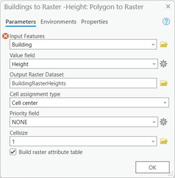
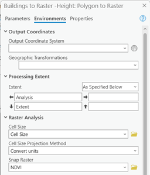

#### e. Buildings

e.	Buildings: This is an important feature layer that we will use in a couple of processes. To add it to your project you can simply drag it from your contents pane (where all your loaded layers in the project are) and drop it in the Model Builder area. Be sure to set it as a parameter.

Buildings will be connected to 2 main tasks:

##### Sky View Factor

###### Step 1. Convert the building heights to raster:

1)	In the Model Builder window, locate the Toolbox pane on the left. Scroll down and find the "Conversion Tools" toolbox.

2)	Expand the "Conversion Tools" toolbox and find the "To Raster" toolset. Within this toolset, you'll discover the "Polygon to Raster" tool. 

3)	To add the "Polygon to Raster" tool to your model, simply drag and drop it onto the canvas. It will appear as a rectangular icon representing the tool. 

4)	Link the Buildings shapefile as an input feature, using the value Height in the “Value field” and for the output add a name to save the result of the "Polygon to Raster" tool. Link the NDVI raster to the “Snap Raster” and Cell Size to the “Cell Size”, and Analysis Extent in “Extent”, you can find this options on the environments tab.

5)	Configure Tool Parameters: Double-click on the "Polygon to Raster" tool icon on the canvas to open its properties. In the properties window, you can configure the tool's parameters, here, the “Height” value from Building should be selected and you can then give it a specific name and location in Output Raster Dataset (for example we used BuildingRasterHeights) remember to set the cellsize and the extent in the environments tab and click the “OK” button. 


6)	Once you have set the parameters, save your model and you can test it by running it. The "Polygon to Raster" tool will convert the polygons to a raster dataset based on your specifications.

Tip: if you are having problems locating the Polygon to Raster Tool in your ModelBuilder (specially later when you will have several similar tools) then you can right click it and you can find the option “Rename”, this will let you personalize the name and make it easier to differentiate.

|||
|---|---|

###### Step 2. Creating an updated building raster:

We want to give the users the ability to edit the buildings to create and test their own environments. That is why we need to regenerate a new raster that contains the buildings that we generated in the previous step. This will help us update the DSM file as if we had downloaded it with the new buildings already.
For that to be done we need to make use of the Raster Calculator tool with a code that lets us add, subtract or in general allow us to do any mathematical calculations between two different raster files.
You will notice after changing the name of the output, this will also be reflected in your Model Builder area, right after the Polygon to raster that we previously added. This will come in handy because we will be able to connect our output and use it in other tools.

To use the Raster Calculator tool in Model Builder you can do the following:

1)	In the Model Builder window, locate the Toolbox pane on the left side. Scroll down and find the "Spatial Analyst Tools" toolbox.

2)	Expand the "Spatial Analyst Tools" toolbox and locate the "Map Algebra" toolset. Within this toolset, you'll find the "Raster Calculator" tool. 

3)	Drag and drop the "Raster Calculator" tool onto the canvas. It will appear as an icon representing the tool. 

4)	Connect the inputs and outputs of the "Raster Calculator" tool. Click on the output. In this case you will connect the output of the Buildings to Raster, the DTM and the DSM rasters as input (be sure to make them parameters). 


5)	Double-click on the "Raster Calculator" tool to open its parameters. In the expression field, try to replicate the following code with the name of your input files: 

```
Con(IsNull("%Building Raster Height%"),"%Original DSM%",("%Building Raster Height%"+"%DTM%"))
```

This code performs a conditional statement to check if the building raster height is null. If it is null, it replaces it with the original DSM raster; otherwise, it adds the building raster height to the DTM raster. Every value that is within two (“) represents the raster you want to use in that specific calculation. 

Note: If the name of your files don’t match ours or you are scared of making a typo mistake, don’t worry you can also double click the raster you want to add in the “Rasters” window in the top left part of the Raster Calculator tool.

6)	Configure any additional parameters, such as the output raster name, both cell size and analysis extent should be applied to the tool as we did before.  To avoid the tool from creating midway files that we are not going to save later in our project we can use the “in_memory\”  directory in our output options (double clicking the DSM_new Buildings output) for example we named our output and directory to “in_memory\DSM_New”.

7)	Save your model and test it by pressing “Run” to execute the Raster Calculator tool. It will apply the provided code to perform the specified calculations on the input rasters.

Here is an example of how your Model Builder should look like:


###### Step 3: Apply the Stamp Trees tool:

We also want to give the user the freedom to play and test different positions of where trees can be planted and help them find the most efficient configuration. In order to do this we will use a geoprocessing tool that was developed by us, as the actions we needed to do were not available in ArcGIS PRO by default. So you will be using a tool that was developed by ITC students. This is one of the possibilities you can explore applying some coding to your projects. The following code was created in the python coding language and adapted to run in arcpy (which is the way ArcGIS PRO handles python codes).

This tool modifies an existing point layer feature that represents the locations of individual trees in the study area. To achieve this, we also need a polygon input that contains the height values of a pixelated tree at a resolution of 0.5 meters (think of this as your “stamp”). This pixelated tree is then applied to each point that the user added “stamping” or cloning that polygon, resulting in an output layer that contains all the newly added trees. To incorporate these trees into the DEM, the output layer is converted into a raster using the Polygon to Raster geoprocessing tool. The resulting raster is then combined with the original DEM using the raster calculator. This process will make “new trees” appear in your DEM as if they were already there in the first place and prepares the data for subsequent calculations. Essentially, it allows users to interactively modify the DEM by adding or removing trees and incorporating them into the analysis.


|Input editable point layer|          Input polygon is “stamped” at each point location |          Polygon to raster tool|
|---|---|---|

In order to convert the code into a geoprocessing tool that can take user inputs and perform the same operation, the following steps can be done:
1)	Create a new Python Toolbox in ArcGIS Pro or ArcMap:

a.	Open the Catalog Pane: In ArcGIS Pro, you can find the Catalog Pane on the right-hand side of the application interface. Click on the Catalog button to open it. In ArcMap, go to the Customize menu and select Catalog Pane to open it.
b.	Create a new Toolbox: In the Catalog Pane, navigate to the location where you want to create your new Python Toolbox. Right-click on that location and select New > Toolbox. Give your toolbox a name and click OK.

2)	Customize the Toolbox: Now that you have created the toolbox, you can start customizing it by adding tools and scripts. Right-click on the toolbox and select New > Script. This will create a new script tool within the toolbox.

3)	Right click  on the script/ Properties/Parameters to define the input parameters for the script tool, which should include:


a.	Input point feature class (Feature Layer): select point and multipoint at Filter/Feature type. 
b.	Input polygon feature class (Feature Layer): select polygon at Filter/Feature type.
c.	Output polygon feature class (Feature Class): select polygon at Filter/Feature type.

4)	Examine the script tool code and paste the [provided code](StampTrees.py)
5)	Save the toolbox and test the tool in model builder.
6)	Drag and drop the “New Trees” point layer (if you don’t have one you can create a new empty one) and the input polygon “Tree Original Polygons” to be used with the tool. Make sure both are set as parameters.
7)	If needed the polygon to raster tool can also be configured, for this jus be sure that the value field to be converted is selected as “Height”
8)	The resultant Stamped_Trees polygon then has to be converted into a raster, therefore in order to do that we will use another “Polygon to Raster” tool. Be sure to configure it properly with the following parameters, And remember to always connect the Cell Size and Extent variables (and double check they are selected in the environments tab).
9)	To avoid the tool from creating midway files that we are not going to have later in our project we can use the “in_memory\”  directory in hour output options (double clicking the Stamped_Trees output) for example we named our output and directory to “in_memory\Stamped_Trees_PolygonToRaster”.


###### Step 4. Combining the Stamped Trees and the New Buildings rasters:

Now that we have given the users the ability to add or remove the buildings and the trees that they want. We need a way to combine this newly generated rasters into one, that way  we will start creating our own new virtual representation of the city. This is helpful to create new scenarios and test new ideas!

In order to achieve this we will use the Raster Calculator:

1)	In the Model Builder window, locate the Toolbox pane on the left side. Scroll down and find the "Spatial Analyst Tools" toolbox.

2)	Expand the "Spatial Analyst Tools" toolbox and locate the "Map Algebra" toolset. Within this toolset, you'll find the "Raster Calculator" tool. 

3)	Drag and drop the "Raster Calculator" tool onto the canvas. It will appear as an icon representing the tool. 

4)	Connect the inputs and outputs of the "Raster Calculator" tool. Click on the output. In this case you will connect the output of the Buildings new Raster, and the Stamped Trees Polygon to Raster as input. 


5)	Double-click on the "Raster Calculator" tool to open its parameters. In the expression field, try to replicate the following code with the name of your input files: 

```
Con(IsNull("%Stamped_Trees_PolygonToRaster%"),"%DSM_new Buildings%",("%Stamped_Trees_PolygonToRaster%"+"%DSM_new Buildings%"))
```

The code checks if the "%Stamped_Trees_PolygonToRaster%" raster is null (no values present). If it is null (IsNull), it replaces the null values with the "%DSM_new Buildings%" raster. However, if the "%Stamped_Trees_PolygonToRaster%" raster is not null, it adds the values of "%Stamped_Trees_PolygonToRaster%" to the "%DSM_new Buildings%" raster.  

Note: If the name of your files don’t match ours or you are scared of making a typo mistake, don’t worry you can also double click the raster you want to add in the “Rasters” window in the top left part of the Raster Calculator tool.

6)	Configure any additional parameters, such as the output raster name, both cell size and analysis extent should be applied to the tool as we did before.  And use the “in_memory\ DSM_NEW_B_T”  directory in our output options.

7)	Save your model and test it by pressing “Run” to execute the Raster Calculator tool. It will apply the provided code to perform the specified calculations on the input rasters.

###### Step 5. Resample raster:

Now we need to be sure the cellsize of our project is consistent, and for this we will need to use the Resample tool:


1)	In the Model Builder window, locate the Toolbox pane on the left side. Scroll down and find the "Spatial Analyst Tools" toolbox.

2)	Expand the "Spatial Analyst Tools" toolbox and locate the "Map Algebra" toolset. Within this toolset, you'll find the "Resample" tool. 

3)	Drag and drop the "Resample" tool onto the canvas. It will appear as an icon representing the tool. 

4)	Connect the inputs of the "Resample" tool: Click on the output. In this case you will connect the output of the DSM_New_B_T raster as input. 

5)	Configure any additional parameters, such as the output raster name and analysis extent should be applied to the tool as we did before. And use the “in_memory\DSM_FILLED_Resample”  directory in our output options.

6)	Save your model and test it by pressing “Run” to execute the Raster Calculator tool. It will apply the provided code to perform the specified calculations on the input rasters.


###### Step 6 Calculate the Sky View Factor (SVF):

After preparing our data to able to interact and be compatible with each other, now we can finally apply another Arcpy based script tool to our project. This tool will calculate the SVF, you can check [the code](SkyviewFactor.py) we will use.

In order to convert the code into a geoprocessing tool that can take user inputs and perform the same operation, the following steps can be done:
1)	Create a new Python Toolbox in ArcGIS Pro or ArcMap:

a.	Open the Catalog Pane: In ArcGIS Pro, you can find the Catalog Pane on the right-hand side of the application interface. Click on the Catalog button to open it. In ArcMap, go to the Customize menu and select Catalog Pane to open it.
b.	Create a new Toolbox: In the Catalog Pane, navigate to the location where you want to create your new Python Toolbox. Right-click on that location and select New > Toolbox. Give your toolbox a name and click OK.

2)	Customize the Toolbox: Now that you have created the toolbox, you can start customizing it by adding tools and scripts. Right-click on the toolbox and select New > Script. This will create a new script tool within the toolbox.

3)	Right click  on the script/ Properties/Parameters to define the input parameters for the script tool, which should include:


a.	Input DSM (Raster Layer): Direction as Input
b.	Output (Raster Layer) Direction as Output


4)	Examine the script tool code and paste the [provided code](SkyviewFactor.py)

5)	Save the toolbox and test the tool in model builder.

6)	The resultant DSM_FILLED_Resample raster obtained in the last step will be used as an input. There is no need to connect the Cell Size and Extent variables.


7)	To avoid the tool from creating midway files that we are not going to have later in our project we can use the “in_memory\”  directory in hour output options (double clicking the SVF output) for example we named our output and directory to “in_memory\SVF”.

#### [![Next]](Section%202-2.md)


<!---------------------------------------------------------------------------->

[Next]: https://img.shields.io/badge/Next-37a779?style=for-the-badge


