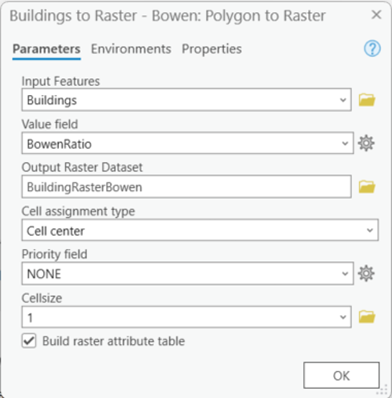
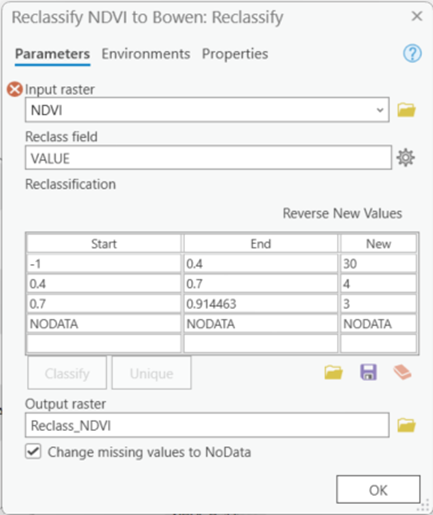

##### 	BOWEN RATIO: 
For this part we will also use the Building and NDVI variables that we added at the beginning. Therefore, there is no need to add them again to the ModelBuilder. Whenever you need to use them just drag a connection arrow to the geoprocessing tool and you are set to continue.


##### A.	BUILDING EFFECT ON BOWEN RATIO

###### Step 1. Assign Bowen to Buildings: 

We will need to assign the Bowen values to the Buildings, therefore we will use the geoprocessing tool Calculate Field.

1)	In the Catalog pane, navigate to the Geoprocessing Toolbox and expand it.

2)	Expand the Data Management Tools folder and locate the Calculate Field tool.

3)	Drag the Calculate Field tool and drop it onto the Model Builder canvas.

4)	The Calculate Field tool will appear as a new element in the Model Builder.

5)	Click on the Calculate Field tool to select it, and the tool's properties will be displayed in the Geoprocessing pane.

6)	In the Model Builder canvas, click on the field or feature class where you want to add the Calculate Field tool.

7)	Connect the Building shapefile and it will act as the input field or feature class will be connected to the Calculate Field tool as an input. Additionally, connect the extent  variable in order to be able to select it on the environments tab.

8)	In the Geoprocessing pane, configure the properties of the Calculate Field tool.

9)	Specify the input table or feature class by selecting it from the drop-down menu or using the browse button, being in this case the Building.

10)	Enter the field name where you want to calculate a new value in the Field Name parameter, we named ours BowenRatio.

11)	Choose the expression or formula you want to use to calculate the field value in the Expression parameter. In our case we used the value 3.

12)	Configure any additional parameters or options based on your specific needs.

13)	Click the Run button to execute the Calculate Field tool and perform the field calculation.

14)	The output field will be updated with the calculated values.


###### Step 2. Convert Buildings to Raster - Bowen: 

With the freshly assigned Bowen values to the Building shapefile we need to convert this to a Raster in order to be able to do some calculations. Therefore you need to do the following:

1)	In the Model Builder window, locate the Toolbox pane on the left. Scroll down and find the "Conversion Tools" toolbox.

2)	Expand the "Conversion Tools" toolbox and find the "To Raster" toolset. Within this toolset, you'll discover the "Polygon to Raster" tool. 

3)	To add the "Polygon to Raster" tool to your model, simply drag and drop it onto the canvas. It will appear as a rectangular icon representing the tool. 

4)	Link the Buildings resultant shapefile from the previous step as an input feature, using the value Height in the “Value field” and for the output add a name to save the result of the "Polygon to Raster" tool. Link the NDVI raster to the “Snap Raster” and Cell Size to the “Cell Size”, and Analysis Extent in “Extent”, you can find this options on the environments tab.

5)	Configure Tool Parameters: Double-click on the "Polygon to Raster" tool icon on the canvas to open its properties. In the properties window, you can configure the tool's parameters, here, the “BowenRatio” value from Building should be selected and you can then give it a specific name and location in Output Raster Dataset (for example we used BuildingRasterBowen) remember to set the cellsize and the extent in the environments tab and click the “OK” button. 


6)	Once you have set the parameters, save your model and you can test it by running it. The "Polygon to Raster" tool will convert the polygons to a raster dataset based on your specifications.

**Tip**: if you are having problems locating the Polygon to Raster Tool in your ModelBuilder (specially later when you will have several similar tools) then you can right click it and you can find the option “Rename”, this will let you personalize the name and make it easier to differentiate.



###### Step 3. Reclassify NDVI to Bowen: 
Parallel to the previous step you have to do a reclassification of the values that are in the NDVI according to the Bomen ranges. This will be done with the Reclassify geoprocessing tool as follows:


1)	In the Catalog pane, navigate to the Geoprocessing Toolbox and expand it.

2)	Expand the Spatial Analyst Tools folder and locate the Reclassify tool.

3)	Drag the Reclassify tool and drop it onto the Model Builder canvas.

4)	The Reclassify tool will appear as a new element in the Model Builder.

5)	Click on the Reclassify tool to select it, and the tool's properties will be displayed in the Geoprocessing pane.

6)	In the Model Builder canvas, click on the raster dataset or layer where you want to apply the Reclassify tool.

7)	The NDVI will be connected to the Reclassify tool as an input. And be sure to connect the Extent and Cell Size variables to use them in their respective properties in the environments tab.

8)	In the Geoprocessing pane, configure the properties of the Reclassify tool.

9)	Specify the input raster by selecting it from the drop-down menu or using the browse button.

10)	Set up the reclassification rules for the input raster in the Reclassification parameter. This can be done by clicking on the pencil icon or using the Import button to load a pre-defined remap table.

11)	Adjust any additional parameters or options based on your specific needs. For example, the Reclass field will be VALUE. Also check the image showing the classification ranges that we selected. Be sure to name your Output raster and save it somewhere you can find it easily later on (we called ours Pre NDVI).

12)	Click the Run button to execute the Reclassify tool and perform the raster reclassification.

13)	The output raster will be generated according to the reclassification rules and settings you specified.

14)	Save the Model Builder if desired for future use.



###### Step 4. Converting NDVI values to proper Bowen classification: 
The Bowen ratio ranges from numbers lower than 0.1 for tropical oceans to numbers higher than 10 for deserts. This will help us identify the heat that is being transferred through latent heat flux (evaporation). 

In order to get this values we can use a raster calculator tool to apply a specific formula to the values in the raster obtained in the last step.

1)	In the Model Builder window, locate the Toolbox pane on the left side. Scroll down and find the "Spatial Analyst Tools" toolbox.

2)	Expand the "Spatial Analyst Tools" toolbox and locate the "Map Algebra" toolset. Within this toolset, you'll find the "Raster Calculator" tool. 

3)	Drag and drop the "Raster Calculator" tool onto the canvas. It will appear as an icon representing the tool. 

4)	Connect the inputs and outputs of the "Raster Calculator" tool. Click on the output. In this case you will connect the output of the Reclassify NDVI to Bowen, the Extent and Cell Size as inputs.


5)	Double-click on the "Raster Calculator" tool to open its parameters. In the expression field, try to replicate the following code with the name of your input files: 

"%Pre NDVI%"/10

This code performs a division by 10 to every value in the previously obtained classified NDVI allowing each value to be compatible with the Bowen values we added to the Building Raster Bowen. We will eventually merge this two rasters together and that is the reason why they must match in units.

*Note*: If the name of your files don’t match ours or you are scared of making a typo mistake, don’t worry you can also double click the raster you want to add in the “Rasters” window in the top left part of the Raster Calculator tool.

6)	Configure any additional parameters, such as the output raster name, both cell size and analysis extent should be applied to the tool as we did before.  To avoid the tool from creating midway files that we are not going to save later in our project we can use the “in_memory\”  directory in our output options (double clicking the output) for example we named our output and directory to “in_memory\NDVI_Reclass”.

7)	Save your model and test it by pressing “Run” to execute the Raster Calculator tool. It will apply the provided code to perform the specified calculations on the input rasters.

###### Step 5. Buildings to Bowen Conditional: 
This is the moment we mix both of the raster outputs we have obtained so far, we have the effect that the buildings will have and this now will change if a building is added or removed. In order to  achieve this we need to use the Raster Calculator tool: 

1)	In the Model Builder window, locate the Toolbox pane on the left side. Scroll down and find the "Spatial Analyst Tools" toolbox.

2)	Expand the "Spatial Analyst Tools" toolbox and locate the "Map Algebra" toolset. Within this toolset, you'll find the "Raster Calculator" tool. 

3)	Drag and drop the "Raster Calculator" tool onto the canvas. It will appear as an icon representing the tool. 

4)	Connect the inputs and outputs of the "Raster Calculator" tool. Click on the output. In this case you will connect the output NDVI RECLASS and the output of the Building Raster to Bowen that we obtained in the previous steps, the Extent and Cell Size as inputs.


5)	Double-click on the "Raster Calculator" tool to open its parameters. In the expression field, try to replicate the following code with the name of your input files: 

```
Con(IsNull("%Building Raster Bowen%"),"%NDVI RECLASS%",("%Building Raster Bowen%"))
```

This code is checking if the "Building Raster Bowen" dataset is null. If it is null, the output will be "%NDVI RECLASS%", and if it is not null, the output will be "%Building Raster Bowen%". The Con function provides flexibility in assigning values based on specific conditions, allowing you to handle different scenarios within your geoprocessing workflows.

Note: If the name of your files don’t match ours or you are scared of making a typo mistake, don’t worry you can also double click the raster you want to add in the “Rasters” window in the top left part of the Raster Calculator tool.

6)	Configure any additional parameters, such as the output raster name, both cell size and analysis extent should be applied to the tool as we did before.  To avoid the tool from creating midway files that we are not going to save later in our project we can use the “in_memory\”  directory in our output options (double clicking the output) for example we named our output and directory to “in_memory\NDVI_Build”.

7)	Save your model and test it by pressing “Run” to execute the Raster Calculator tool. It will apply the provided code to perform the specified calculations on the input rasters.

This should give you and idea of how this part of your ModelBuilder should look like:


#### [Next](Section%202-3.md)