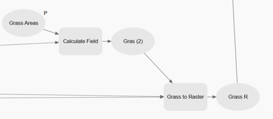

##### B.    GRASS EFFECT ON BOWEN RATIO

Now we will try to obtain the effect of the grass in the Bowen Ratio, for this you will need to add the grass areas shapefile to your ModelBuilder by dragging it and dropping it into the model area, be sure to make it a parameter.

###### Step 1. Assign Bowen value to Grass: 

We will need to assign the Bowen values to the grass polygons, therefore we will use the geoprocessing tool Calculate Field.

1)	In the Catalog pane, navigate to the Geoprocessing Toolbox and expand it.

2)	Expand the Data Management Tools folder and locate the Calculate Field tool.

3)	Drag the Calculate Field tool and drop it onto the Model Builder canvas.

4)	The Calculate Field tool will appear as a new element in the Model Builder.

5)	Click on the Calculate Field tool to select it, and the tool's properties will be displayed in the Geoprocessing pane.

6)	In the Model Builder canvas, click on the field or feature class where you want to add the Calculate Field tool.

7)	Connect the Grass shapefile and it will act as the input field or feature class will be connected to the Calculate Field tool as an input. Additionally, connect the extent  variable in order to be able to select it on the environments tab.

8)	In the Geoprocessing pane, configure the properties of the Calculate Field tool.

9)	Specify the input table or feature class by selecting it from the drop-down menu or using the browse button, being in this case “Gras”.

10)	Enter the field name where you want to calculate a new value in the Field Name parameter, we named ours Grass Areas.

11)	Choose the expression or formula you want to use to calculate the field value in the Expression parameter. In our case we used the value 4.

12)	Configure any additional parameters or options based on your specific needs.

13)	Click the Run button to execute the Calculate Field tool and perform the field calculation.

14)	The output field will be updated with the calculated values.


###### Step 2. Convert Grass to Raster: 
With the freshly assigned Bowen values to the Grass shapefile we need to convert this to a Raster in order to be able to do some calculations. Therefore you need to do the following:

1)	In the Model Builder window, locate the Toolbox pane on the left. Scroll down and find the "Conversion Tools" toolbox.

2)	Expand the "Conversion Tools" toolbox and find the "To Raster" toolset. Within this toolset, you'll discover the "Polygon to Raster" tool. 

3)	To add the "Polygon to Raster" tool to your model, simply drag and drop it onto the canvas. It will appear as a rectangular icon representing the tool. 

4)	Link the resultant shapefile from the previous step as an input feature, using the value Height in the “Value field” and for the output add a name to save the result of the "Polygon to Raster" tool. Link the NDVI raster to the “Snap Raster” and Cell Size to the “Cell Size”, and Analysis Extent in “Extent”, you can find this options on the environments tab.

5)	Configure Tool Parameters: Double-click on the "Polygon to Raster" tool icon on the canvas to open its properties. In the properties window, you can configure the tool's parameters, here, the value from the calculated field for Grass should be selected and you can then give it a specific name and location in Output Raster Dataset (for example we used in_memory\Gras_PolygonToRaster) remember to set the cellsize and the extent in the environments tab and click the “OK” button. 

6)	Once you have set the parameters, save your model and you can test it by running it. The "Polygon to Raster" tool will convert the polygons to a raster dataset based on your specifications.



###### Step 3. Joining Grass and Buildings Bowen Values: 
This is the moment we mix both of the raster outputs we have obtained so far, we have the effect that the buildings and grass will have and we will also know what value will be retained if a building or patch of grass is added or removed. In order to  achieve this we need to use the Raster Calculator tool: 

1)	In the Model Builder window, locate the Toolbox pane on the left side. Scroll down and find the "Spatial Analyst Tools" toolbox.

2)	Expand the "Spatial Analyst Tools" toolbox and locate the "Map Algebra" toolset. Within this toolset, you'll find the "Raster Calculator" tool. 

3)	Drag and drop the "Raster Calculator" tool onto the canvas. It will appear as an icon representing the tool. 

4)	Connect the inputs and outputs of the "Raster Calculator" tool. Click on the output. In this case you will connect the output Grass to Raster and the output of the Building to Bowen Conditional that we obtained in the previous steps, the Extent and Cell Size as inputs.


5)	Double-click on the "Raster Calculator" tool to open its parameters. In the expression field, try to replicate the following code with the name of your input files: 
```
Con(IsNull("%Grass R%"),"%NDVI_Buildings%",("%Grass R%"/10))
```

This code checks if the "Grass R" dataset is null. If it is null, the output will be "%NDVI_Buildings%". If it is not null, the output will be the value of "%Grass R%" divided by 10. The Con function provides a way to handle different scenarios and apply specific operations based on conditional logic in your geoprocessing tasks.

**Note**: If the name of your files don’t match ours or you are scared of making a typo mistake, don’t worry you can also double click the raster you want to add in the “Rasters” window in the top left part of the Raster Calculator tool.

6)	Configure any additional parameters, such as the output raster name, both cell size and analysis extent should be applied to the tool as we did before.  To avoid the tool from creating midway files that we are not going to save later in our project we can use the “in_memory\”  directory in our output options (double clicking the output) for example we named our output and directory to “in_memory\Bowen_Grass”.

7)	Save your model and test it by pressing “Run” to execute the Raster Calculator tool. It will apply the provided code to perform the specified calculations on the input rasters.

##### [![Next]](Section%202-4.md)

<!---------------------------------------------------------------------------->

[Next]: https://img.shields.io/badge/Next-37a779?style=for-the-badge