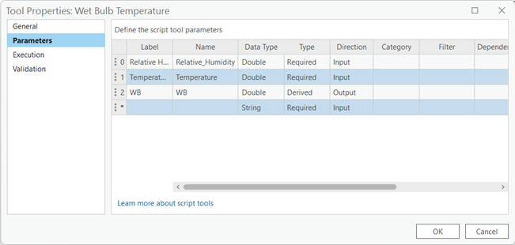
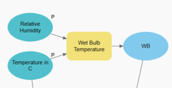

### 	WET BULB: 
We are getting pretty close to calculate the PET in our target city. We need to get some additional values that we will need for the PET equation, but don’t worry, the most tedious parts have already been done by now, so if you have been following this guide in order the upcoming parts should feel like a breeze for you. For this part we will need to add some values directly to the ModelBuilder and use them to calculate the Wet Bulb. For this do the following:

##### Step 1. Add a Relative Humidity value: 
We could easily add this value directly into the equation of the PET analysis but that wouldn’t let us change it if we want to check a different city, day or year. Therefore if we want that value to be editable later on it is better for us to add the value in the following way:

Go to the “insert” ribbon in the ModelBuilder tab, select the variable button. You will see a small window appear called Variable Data Type, that will let you choose from different preestablished data representations, be sure to look for the “Double” type in the dropdown list and press ok when you are fine with your selection. Be sure to make it a parameter.

##### Step 2. Add the default value to Relative Humidity: 
If you want the PET tool to always load the same value as default you can easily stablish this by double clicking the recently added  Relative Humidity variable and typing the Relative Humidity value that you found when you investigated the warmest day in your study area. Ours was 47. 

You will have to do a similar procedure to add a second variable called Temperature in C.

##### Step 3. Add a Temperature in C: 
Again, we could easily add this value directly into the equation of the PET analysis but that wouldn’t let us change it if we want to check a different city, day or year. Therefore if we want that value to be editable later on it is better for us to add the value in the following way:

Go to the “insert” ribbon in the ModelBuilder tab, select the variable button. You will see a small window appear called Variable Data Type, that will let you choose from different preestablished data representations, be sure to look for the “Double” type in the dropdown list and press ok when you are fine with your selection. Be sure to make it a parameter.

##### Step 4. Add the default value to Relative Humidity: 
If you want the PET tool to always load the same value as default you can easily stablish this by double clicking the recently added  Temperature in C variable and typing the Temperature value that you found when you investigated the warmest day in your study area. Ours was 40.2. 

#### Step 5. Calculate the Wet Bulb Temperature: 
There is no specific tool in ArcGIS PRO to generate the Wet Bulb temperature then you know what that means, we need to create our own.

In order to convert the code into a geoprocessing tool that can take user inputs and perform the same operation, the following steps can be done:

1)	Create a new Python Toolbox in ArcGIS Pro or ArcMap:

a.	Open the Catalog Pane: In ArcGIS Pro, you can find the Catalog Pane on the right-hand side of the application interface. Click on the Catalog button to open it. In ArcMap, go to the Customize menu and select Catalog Pane to open it.

b.	Create a new Toolbox: In the Catalog Pane, navigate to the location where you want to create your new Python Toolbox. Right-click on that location and select New > Toolbox. Give your toolbox a name and click OK.

2)	Customize the Toolbox: Now that you have created the toolbox, you can start customizing it by adding tools and scripts. Right-click on the toolbox and select New > Script. This will create a new script tool within the toolbox.

3)	Right click  on the script/ Properties/Parameters to define the input parameters for the script tool, which should include:

a.	Input Relative Humidity (Double): Direction as Input
b.	Input Temperature (Double): Direction as Input
c.	Output WB (Double) Direction as Output

4)	Examine the script tool code and paste the [provided code](WetbulbTemp.py) in

5)	Save the toolbox and test the tool in model builder.

6)	The Relative Humidity and the Temperature in C values created in the last step will be used as an input. And WB will be the generated Wet Bulb number. There is no need to connect the Cell Size and Extent variables.

#### [Next](Section%202-6.md)
