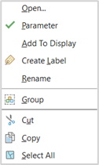
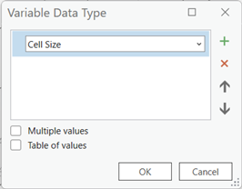
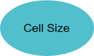
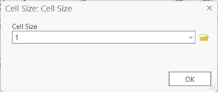
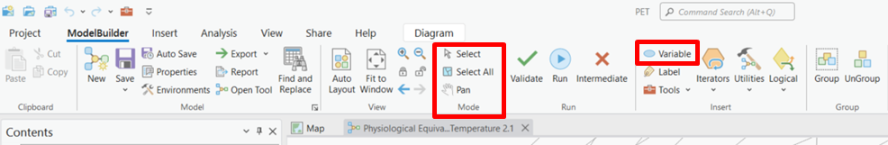
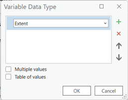
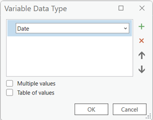
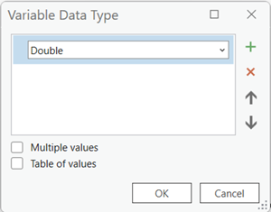
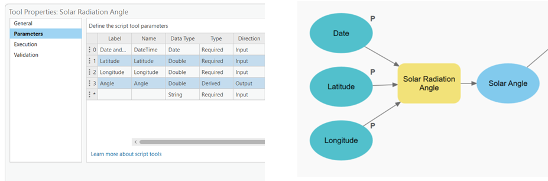

## Section 2: PET Calculation Workflow

Now, let's outline the step-by-step workflow for calculating PET using ArcGIS Pro. We'll cover the essential tools and explain their roles in the process. Don't worry if it seems overwhelming at first – we'll break it down into manageable steps:

## 1.	Climate Variables: 
The first step is to keep at hand the values of the temperature, humidity, solar radiation, solar angle, wet bulb temperature values that you respectively collected. We'll use the this values directly into the equation later on in our calculation process.

---
## 2.	Deriving PET Inputs: 
PET calculation requires additional inputs, such as wind speed and solar radiation. We'll explain how to derive these inputs using various geoprocessing tools, such as the Calculate Statistics tool and the Area Solar Radiation tool.

a.	Wind Speed

b.	Bowen Ratio: NDVI is categorized, water bodies, grass, buildings and trees are later added to the categorized NDVI raster.

c.	DEM

d.	Sky View Factor

In order to do this you will need to know how to work with the Model Builder Tool. It is very helpful as it is a visual programming tool in ArcGIS Pro that allows you to create, customize, and automate geoprocessing workflows. First, let’s get you familiarized with some basic concepts in Model Builder: 

#### In Model Builder

The items displayed on the canvas have different colours and shapes, which convey specific meanings. Here's an explanation of the colour and shape meanings for each item in Model Builder:

a.	Tool: Tools are represented by rectangular icons on the canvas. They perform geoprocessing operations or analyses. The colour of the tool icon is typically blue.

b.	Variable: Variables are represented by oval icons on the canvas. They store data or values used as inputs or outputs in your model. The colour of the variable icon is typically green.

c.	Input: Inputs are represented by thin, solid lines connecting the outputs of one tool or variable to the inputs of another tool. The input line is usually black.

d.	Output: Outputs are represented by thick, solid lines connecting the outputs of a tool or variable to the inputs of another tool or variable. The output line is usually black.

e.	Model Parameter: Model parameters are inputs or outputs that can be configured when running the model. They are represented by a small flag icon attached to the tool or variable. The colour of the flag icon is typically purple.

f.	Derived Output: Derived outputs are outputs that are generated by a tool but not explicitly connected to other tools. They are represented by dashed lines connecting the output of a tool to the canvas. The dashed line is usually black.

g.	Branch: A branch represents a logical flow in the model where one set of tools or operations is executed based on a conditional statement. It is represented by a diamond-shaped icon. The colour of the branch icon is typically orange.

h.	Model Label: Model labels are used to provide descriptive text or comments on the canvas. They are represented by rectangular boxes with a folded corner. The colour of the model label icon is typically gray.

These colour and shape conventions help visually distinguish between different elements in your model, making it easier to understand the structure and flow of your geoprocessing workflows in Model Builder. By utilizing these visual cues, you can quickly identify tools, variables, inputs, outputs, branches, and labels, facilitating the design and comprehension of your models.

--- 
You should also get familiar with actions, including adding variables, tools, defining inputs and outputs, and linking them together:

a.	Opening Model Builder: To start using Model Builder, open ArcGIS Pro and create or open a project. Then, navigate to the "Analysis" tab on the ribbon and click on the "ModelBuilder" button to launch the Model Builder interface.

b.	Adding Variables: Variables represent the data or values that will be used as inputs or outputs in your model. To add a variable, you can either right-click on the canvas or click on the "Add Variable" button in the Model Builder toolbar. Specify the variable's name, data type, and any other necessary properties. Variables can be used to store input data, intermediate results, or output data.

c.	Adding Tools: Tools represent geoprocessing operations that perform specific tasks or analyses. To add a tool to your model, you can either search for it in the "Toolbox" pane and drag it onto the canvas or click on the "Insert" button in the Model Builder toolbar and choose the desired tool from the list. Each tool has its own set of parameters that you can configure based on your requirements.

d.	Defining Inputs: Inputs are the data or variables that you provide to the tools for analysis. To define an input for a tool, you can either drag a variable from the Variables pane onto the tool or right-click on the tool and choose "Model Parameter" to create a new input variable. Inputs can be features, rasters, tables, or any other applicable data type.

e.	Defining Outputs: Outputs are the results generated by the tools in your model. To define an output, you can either right-click on a tool and choose "Model Parameter" or drag an existing variable to the tool. Outputs can be specified as variables, allowing you to use them as inputs for subsequent tools or store them as final results.

f.	Linking Inputs and Outputs: To connect the inputs and outputs between tools, you can click and drag from the output of one tool to the input of another tool. This establishes the flow of data and dependencies within your model. You can also link inputs and outputs to variables by dragging connections to or from the variables on the canvas.

g.	Configuring Tool Parameters: For each tool in your model, you can double-click on it to open its properties dialog. Here, you can configure the tool's parameters, such as specifying input datasets, setting analysis options, defining output locations, and adjusting any other relevant settings.

h.	Running the Model: Once you have built and configured your model, you can run it by clicking on the "Run" button in the Model Builder toolbar. This will execute each tool in the model in the defined order, passing inputs and collecting outputs as specified. You can monitor the progress and view any generated messages or warnings during the execution.

**Note**: It is also important to know that some variables and features will need to be set as “Parameter” in the Model Builder, this can be done by right clicking it and setting the green check on in the menu that will pop up. Whenever you do this a small P will appear beside your feature or variable letting you know which ones have or have not been set already. Now you know what we mean when we ask you to set a variable or feature as parameter.

In Model Builder, setting features and variables as parameters is like making your geoprocessing model flexible and customizable. Parameters allow you to input different values or datasets when running the model, without having to modify the model itself. It's like having adjustable dials on a control panel. Have you seen when a program asks you to input a name or a file before running a process? This is what you will be able to achieve when you set inputs as parameters. This flexibility makes your model more versatile and adaptable to different scenarios. It's like giving your model a set of knobs and switches so that you can fine-tune its behaviour for specific needs without rebuilding it from scratch.

By utilizing variables, tools, inputs, outputs, and linking them together, Model Builder allows you to create complex geoprocessing workflows in a visual and intuitive manner. This empowers you to automate repetitive tasks, streamline analyses, and improve efficiency in your GIS workflows.

---

## 3.	How to add each different PET input to your Model Builder:

Our main goal will be to process most of the collected data for the PET into raster files in order to unlock valuable insights and enable comprehensive analysis. By processing and converting the data to a raster format, we can create a visual representation that captures the spatial patterns and variations of the Physiological Equivalent Temperature (PET) across the study area. This allows us to perform further analysis, identify hotspots or cool zones, and make informed decisions. It's like unravelling the hidden stories within the data and transforming them into a meaningful and actionable format. 

There are 2 main values that will be recurring throughout the whole model, we will be “calling” them for several processes and the idea is to just define them once so you don’t have to be changing several variables when you can only change the main one. This 2 values are:

#### a.	Cell Size: 
Imagine your geographic data as a grid, like a pixelated image. Each cell in the grid represents a specific area on the ground, like a tiny square. The cell size refers to the size of each of these square cells. A smaller cell size means smaller and more detailed squares, while a larger cell size means larger and less detailed squares. The cell size determines the level of resolution and precision in your data. Smaller cell sizes provide finer details and accuracy, but require more storage and processing power. On the other hand, larger cell sizes sacrifice some detail but are more efficient in terms of storage and processing. So, choosing the right cell size is important to balance data quality and performance in your GIS analysis and mapping tasks. 

This cell size must remain as similar as possible within all the processes we will do in the project to avoid as much as possible to miscalculate our results. To achieve this, you can add the Cell Size as a variable and selecting the data type as “Cell Size”.  

You will see your variable appear in your model builder and you will be able to double click it to assign it a predefined value (this value will depend on your Coordinate System, as we are using the Amersfoort / RD New (EPSG:28992) our variable will be considered in meters). Additionally, be sure to set it as parameter.

| ||
|---|---|---|

#### b.	Analysis Extent: 
Think of the analysis extent as a boundary that defines the area you want to focus on in your GIS analysis. It's like putting a frame around a picture to zoom in on a specific region. The analysis extent determines the spatial coverage of your analysis and limits it to a specific area of interest. By setting the analysis extent, you can narrow down your study area and concentrate your analysis on the relevant geographic features within that boundary. It helps you zoom in on the details that matter and avoid unnecessary computations on areas outside of your interest. So, it's like putting on a pair of virtual glasses to narrow your focus and analyse the world within a specific window.

This “window” can help us select the desired area to be calculated for our PET analysis and help us do faster calculations localized only on our area of interest. Be sure to set it as a parameter.

In order to establish the extent of the whole project you can go to the “insert” ribbon in the ModelBuilder tab, select the variable button. You will see a small window appear called Variable Data Type, that will let you choose from different preestablished data representations, be sure to look for the “Extent” type in the dropdown list and press ok when you are fine with your selection.

We then have to work on our individual values and the way each of them is going to be calculated and combined with other values or tools in order to obtain the necessary outputs that we can use in our PET equation. If you have been following this guide in order you should have all your downloaded data already loaded in your ArcGIS PRO project. If by any chance you haven’t done this by now, this is a good moment to do it. Also if you need to refresh your memory on how the PET equation looks you can always check the Section 2: Understanding the Science Behind PET. 
As we told you before we will start by doing our first calculation inside of the ModelBuilder. You will se we added names to this process because it makes it very easy to understand and remember what it does. So try to give your processes easy self explanatory names, that way you can always go back to them and have a general idea of what is happening in you!

#### c.	NDVI: 
This raster file will be the base that we will use to update any calculation related to the NDVI when we start doing changes our area of interest later on. It is a good idea to load it into the Model Builder as it will also help us “snap rasters” in the “Environments” tab under some resultant rasters from some processes.  

Think of snap rasters as magnets that align your data perfectly. When working with multiple datasets in GIS, they may not always align perfectly due to differences in resolution or grid orientation. Snap rasters help ensure that all your datasets line up seamlessly. It's like using a magnetic board to align puzzle pieces. By setting a snap raster, your data snaps to its grid, making sure that each cell matches up precisely with other datasets. This alignment is important for accurate analysis and smooth visualization. It's like having a magical force that pulls your data into perfect alignment, creating a harmonious and cohesive GIS environment.

You can drag the NDVI raster that we obtained at the beginning of the guide and drop it in the ModelBuilder work area. Be sure to make it a parameter.

#### d.	Solar Angle : 
This one will be a good way to make you started in understanding how to use some processes in ModelBuilder to obtain a resulting value, shapefile, or raster. As we did with the “Extent” and “Cell Size” variables we can add some new variables that we will use and used them. To start, simply add the following variables, remember that you add them directly from the Insert menu in the ModelBuilder tab and then you select the type of data you want to add:

*	Date: For this case you select the Date data type. Be sure to make it a parameter. If  you open it you will have the option to add a date and time. Here is important that after you identified the warmest year, day and time of the city you are researching and select it here.
*	Latitude: You wont find a “Latitude” data type, therefore for this you will need a “Double” type. Be sure to make it a parameter. Here you should also include the latitude of your study area.
*	Longitude: You wont find a “Longitude” data type, therefore for this you will need a “Double” type. Be sure to make it a parameter. And also include the longitude of your study area.

|||
|---|---|

*	Solar Radiation Angle Calculation: In order to calculate the Solar Radiation Angle we will need to use a Phyton code that is compatible with Arcgis. This codes are called Arcpy and they are very powerful whenever we can’t find a geoprocessing tool for a specific task in our project. Then if it is not available we can create our own geoprocessing tools and do calculations within ArcGIS PRO. Don’t worry, there is a code already prepared by us that will take the basic calculations of the Solar Radiation Angle and apply it to our recently created variables.
In order to convert the code into a geoprocessing tool that can take user inputs and perform the same operation, the following steps can be done:
1)	Create a new Python Toolbox in ArcGIS Pro or ArcMap:

> a	Open the Catalog Pane: In ArcGIS Pro, you can find the Catalog Pane on the right-hand side of the application interface. Click on the Catalog button to open it. In ArcMap, go to the Customize menu and select Catalog Pane to open it.

> b.	Create a new Toolbox: In the Catalog Pane, navigate to the location where you want to create your new Python Toolbox. Right-click on that location and select New > Toolbox. Give your toolbox a name and click OK.

2)	Customize the Toolbox: Now that you have created the toolbox, you can start customizing it by adding tools and scripts. Right-click on the toolbox and select New > Script. This will create a new script tool within the toolbox.

3)	Right click  on the script/ Properties/Parameters to define the input parameters for the script tool, which should include:

>a.	Input date (Date type): Select the value as required and the direction should be set as an input. 

>b.	Input latitude (Double): Select the value as required and the direction should be set as an input. You can set your latitude value in the default column. 

> c.	Input longitude (Double): Select the value as required and the direction should be set as an input. You can set your longitude value in the default column.

> d.	Output Angle (Double): Select the value as derived and the direction should be set as an output. 

4)	Examine the script tool code and paste the provided code in [Chapter 2 Section 1](/Chapter%202%20Data%20Preparation/Section%201/SolarAngle.md) 
5)	Save the toolbox and test the tool in model builder.
6)	The result will be a decimal number that will be used in the PET equation later on.

It was easy right? Now that you know the basics we can move on into operations that will need multiple variables and geoprocessing tools together. There is no need to worry, as long as you apply the concepts you just learned you will do fine. We will also give you step by step instructions on how to proceed so you will not get lost in the process!

#### [Next](Section%202-1.md)