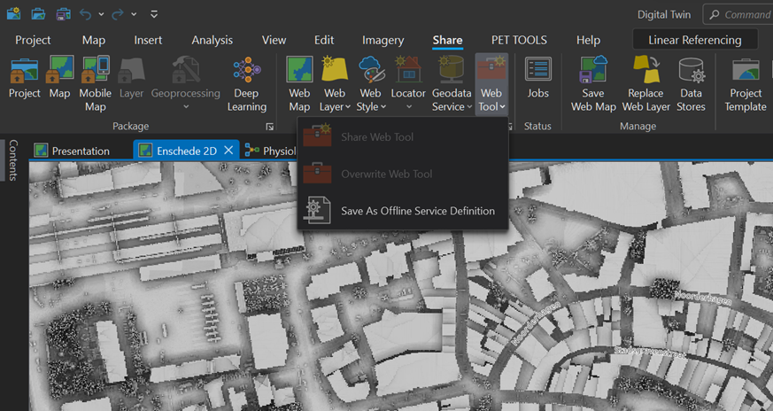

## Section 1: Exporting your Model to a Service Definition

Now that you have configured and run your model at least once, you can export the geoprocessing model to an offline service definition. This is a file format used in the ArcGIS software suite to package and deploy geoprocessing tools, maps, and other GIS resources as web services. It encapsulates all the necessary information and resources required to publish and share geospatial data and functionality over the web.
A service definition file (.sd) contains the following components:

*	Data: The service definition includes the data sources required for the service, such as shapefiles, feature classes, raster datasets, or database connections. These data sources are bundled within the service definition file.

*	Tools and workflows: The service definition contains the configuration and parameters of geoprocessing tools, models, or workflows created within ArcGIS Model Builder or Python scripts. It captures the specific steps, inputs, outputs, and dependencies of the tools to be published as a service.

*	Service properties: The service definition allows you to specify various properties for the web service, such as the service name, summary, description, tags, and access permissions. These properties help describe and identify the service when it is published and made available to users.

*	Service capabilities and settings: The service definition file enables you to define the capabilities and behavior of the web service, including the supported operations (e.g., querying, editing, analysis), maximum number of instances, performance settings, caching options, and security configurations.

*	When a service definition is published, it is deployed to an ArcGIS Server or ArcGIS Online instance, where it is hosted as a web service. This allows users to access and interact with the service using various GIS applications, such as ArcGIS Desktop, ArcGIS Online, or custom web applications, enabling them to perform spatial analyses, visualize maps, and utilize the defined geoprocessing tools remotely.

To export your tool go to the tab Share. Then on the section “Share as” click on Web tool and then click on “Save As Offline Service definition” Just as shown in the next image.

A small window will show up and you need to select the tool you created which is going to be saved as Service Definition

A New panel will show up where you need to fill in the information to save it . Fill Name, Tags and select the type of ArcGIS Server you will upload to, current versions of ArcGIS Server is 11.1. On the data section select Reference all data. This will keep all the layers referenced and there will not be necessary to upload the data to the server.

On the configuration tab activate the capabilities to upload files, set the execution mode to Asynchronous and activate the view output in map option. Finally, on the Content tab click on the yellow pencil to edit the configuration. Then go to each source layer and fill in the description of what the layer contains, this is mandatory for the process to be exported as it will be use as a tooltip for the online tool.

You also need to modify the input mode, change it to User defined value. This will allow for any layer (that follows the same data structure) to be used as input value later on. This is an important step for successfully exporting the tool.

||||
|---|---|---|

Once you have configured the tree tabs click on analyse for identify any error and then click on Save to store the file. A window will pop up asking you for a location where you want to save the file. To ease the process save it on a folder that does not have many characters and does not have spaces in the name.

It will take some time for the tool to export, once is ready we can move to next step.

#### [Next](Section%202.md)
