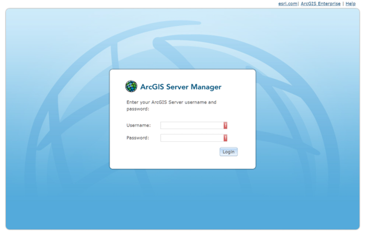
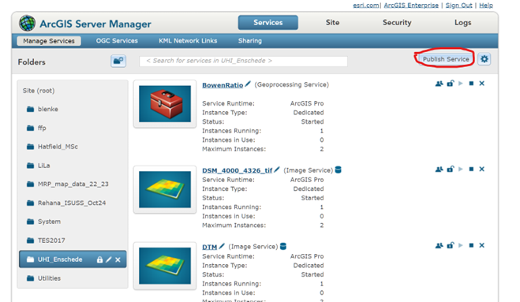
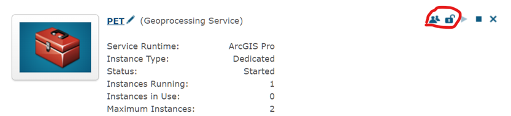
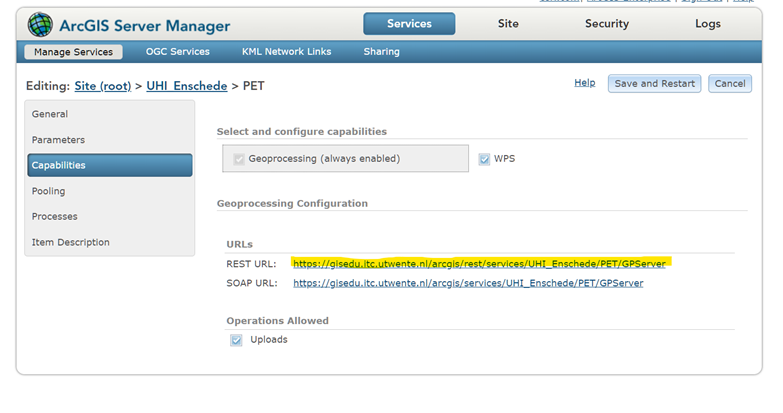

## Section 2: Uploading Service definition in ArcGIS Server

For this step you will need to have credentials to access the ArcGIS Server. Enter your credentials and go inside the platform.

Click on Publish server to upload your file. Select it and click on next. Then verify that type of service is Geoprocessing and that the “Start service immediately” option is activated. Click on next and verify that the Geoprocessing option is on and then click on finalize to activate the service.

Once the service is running you need to share it and make it available for others to consume. Do so by clicking on the person figure and the lock.

Click on the name of the tool to verify the configuration of it and go to the “Capabilities tab” to get the REST URL from which you will be able to access the service. You will need this on the final step.

#### [Next](Section%203.md)