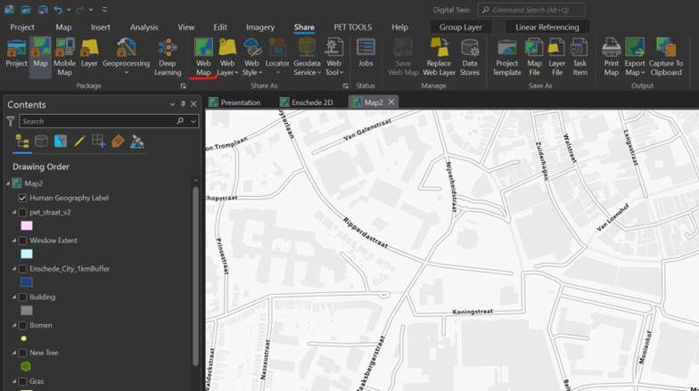
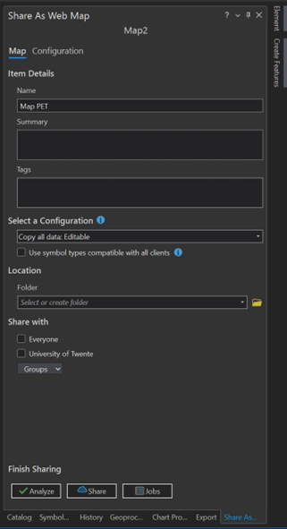

## Section 3: Export your map to ArcGIS Online

Lets go back to ArcGIS Pro so we can export our map to an online map on ArcGIS Online. Open your map where you have all your input layers. Organize the name of your layers and then go to the Share tab on top. Click on “Share Web map” and a new panel will open.

Change your map name and add Tags and summary information. On the configuration select “Copy all data: Editable” this will configure the map so all layers can be accessible to others and be modifiable for testing scenarios. You can select a folder where to store it, within your ArcGIS Online account, and if you want to share the map with others either in your organization or with everyone.  

#### [Next](Section%204.md)