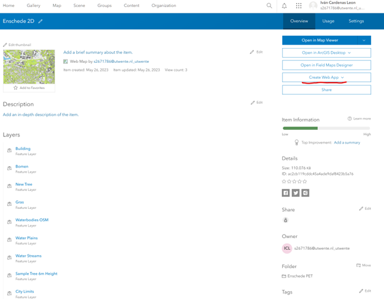
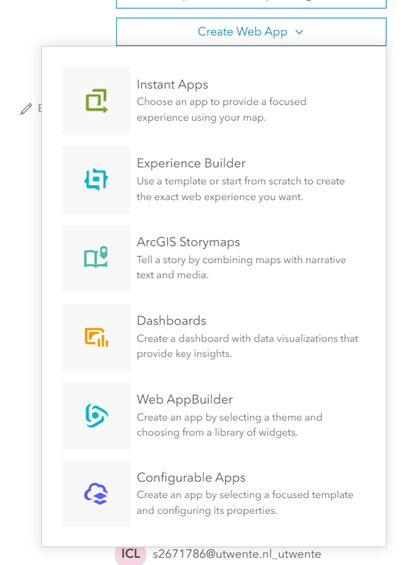
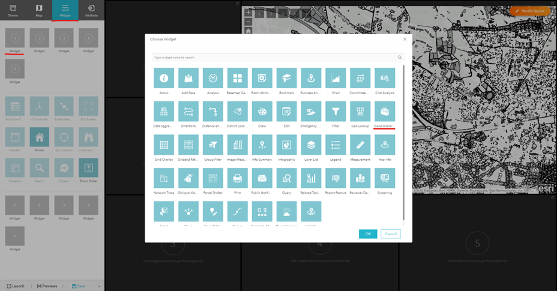
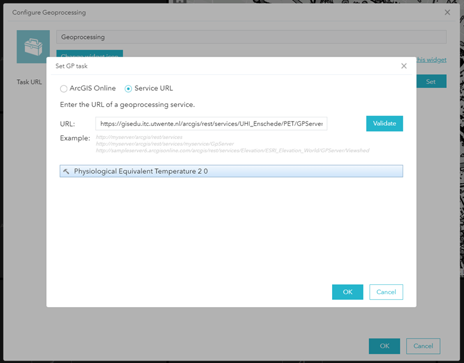

## Section 4: Configure your application

Now that your map is exported is time to create a web application where you can access both the tool and the map. Open your map on the web environment and click on Create web application and create a Web application and give a name to your new app.

|||
|---|---|

Here you can configure your web application to include a widget for calling the geoprocessing process. Go to the Widgets tab and select one of the empty widgets a window will show up where you can select several tools. Click on the Geoprocessing element to activate the widget and click on OK.

In the following window paste the URL of section 2 and click on validate. Then click on OK. On the next window verify the configuration of all layers and if you decide you can set up a default value for each layer. Click on OK to finish the configuration of the layer.

Now in the bottom left corner click on save and then on Launch to run the app.

---
### CONGRATULATIONS! 
#### You have set up your own PET Digital Twin tool, now feel free to edit values, configure your app and explore different results with other inputs.